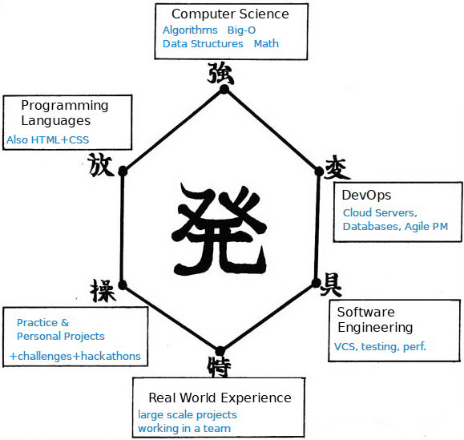
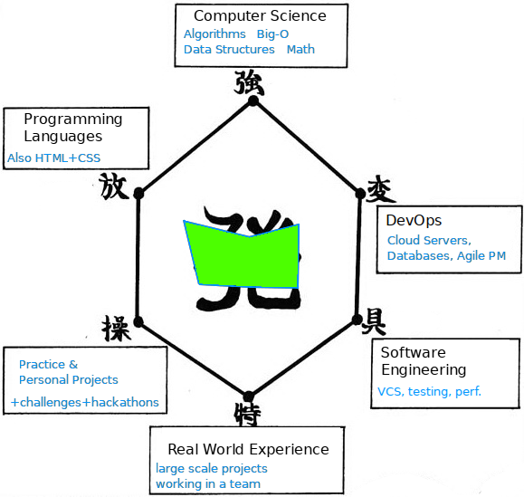
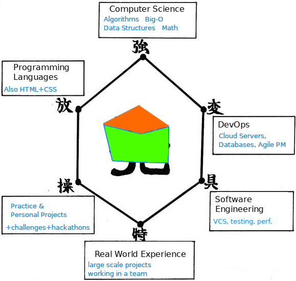
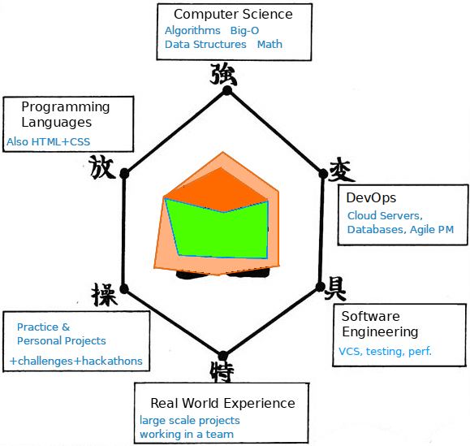

Today I'll teach you about a ***millenary training technique*** I learned while watching a japanese series named **"Hunter x Hunter"**, which I'm using to assign my study time between different developer topics and improve my skills.

##The Basics of Nen

First of all, **Hunter x Hunter** is a japanese animated series (Anime) about people that fight a lot and have superpowers, and that's all you need to know about it. What's important to us is the **theory** behind their superpowers, which I'm sure they copied from some ancient chinese tradition, as they always do.
  
In the series, the **(Nen)** (energy) users can train **6 types of abilities** depending mainly on their natural talents. These types are represented in the hexagonal chart above and you can get a general idea of what each type does.

Also, in the series, they propose that **opposite types in the chart can't be mastered**, but learning them will **greatly benefit** your **main skill**. It also proposes that types **next to each other** are more **closely related** and will be **easier to get to a similar level.**

**What happens if we apply the concepts to developer training?**

##Enter Coder's Nen



Following the concepts from the previous chart, I made a **coder's version** covering what I think are the **core skills** for becoming a **good developer**. In this version, however, you are not limited to mastering a single concept, but I tried to place the topics in the best way possible so the closest ones (connecting lines) are more related and the opposite ones are topics that don't depend on each other.

**Now, how does this work?**

##Area and High Skills 

If you place a **point between the center of the hexagon and the type of skill** being measured, with **center representing 0%** (you don't know anything about that) and **100% being the point in the hexagon**, and then you **connect all the points**, you get a **polygon** (or line) with the **area representing your "core" value as developer.**

In the chart above, I put what I think represents my **current status as developer**. It doesn't seem much, but if you consider that 100% in Computer Science would be **Donald Knuth** and 100% in Software Engineering would be **Bill Gates**, then it might be even less.

Another way to achieve mastery is focusing only in a main topic and the next ones to it. That would make you a specialist, guru or teacher in certain topic, without necessarily making you lose value because the lesser area being covered.
 
For the purpose of "becoming a software developer" though, the area approach is better.

**Now... How do I use this as a guide?**

##Chart as a Guide for Improving your Skills

When you ask yourself, "What should I learn next?" Just **draw the chart**, assign values representing at what level you think you are in certain topic and see what skill you want to learn that will also **maximizes the chart area being covered**.

In my case, looking at the chart shows I'm **kind of** weak in "Computer Science" as I studied Electronics Engineering (which also improves my *Programming Languages* score), so I'm going through some nice books and resources on **Algorithms** and **Data Structures**. Note that improving "Computer Science" just a little has a big impact in the area being covered, and will also help with "Programming languages" and "DevOps", as much of it has to do with data structures, reasoning and algorithms.

**Having a good knowledge in all the chart areas will greatly improve your overall value as developer and (in my opinion) employability.**

##Final thoughts

To finish this entry, the last chart reflects my projections for when I "graduate" from FreeCodeCamp, which would also reflect at least the knowledge needed (in total chart area) for a junior-to-mid level developer position (that's the idea of a Bootcamp right?).

So... **what will you learn today?** Draw the chart and improve your **Coder's Nen!!** (I should really make an app).

