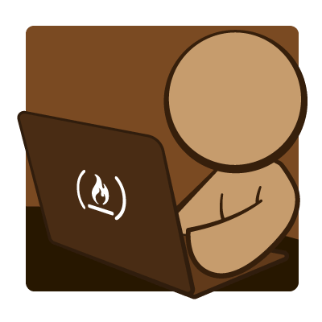
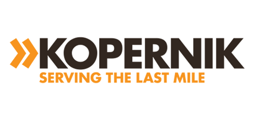
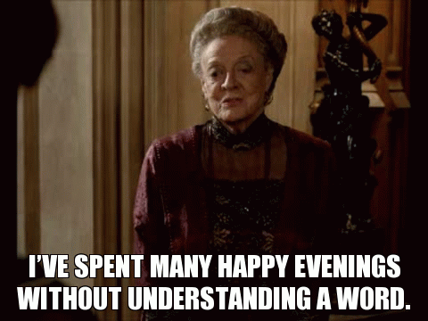
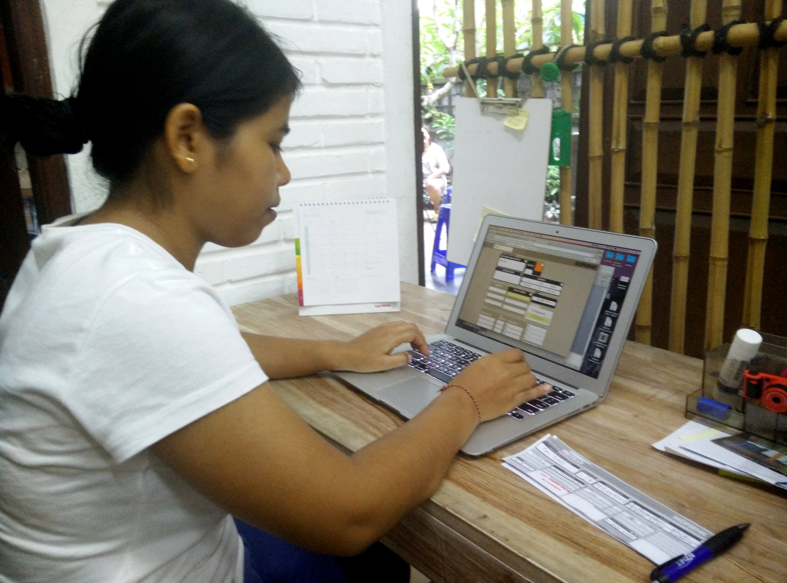

A few days ago, we marked our first nonprofit project at [FreeCodeCamp](http://www.freecodecamp.com) as *shipped*. It was a big milestone (for us and FCC as its first delivered project) and I feel very happy for being able to deliver a working piece of software, but also because the experience has been great and a first on my career. Kopernik has opened my eyes about how technology, even in its simplest forms, can impact the lives of thousands of people, and how we can be part of it.

##FreeCodeCamp

First, I'll do a very, very short review of what FreeCodeCamp does:

FCC is a **free**, online **bootcamp** for aspiring web developers, focused on the *MEAN* stack, and the curriculum has two parts. The first being different free courses found all over the web (soon to be in-house), corresponding to roughly 100 hours, and the second part is making real world projects for nonprofits, which accounts for, also roughly, 900 hours. This way, both ***campers*** and nonprofits benefit from the projects, and there's no money involved in the process. It's a win/win for everyone.

##Kopernik, Serving the Last Mile



After finishing the *challenges* (FreeCodeCamp's curriculum) I got assigned to a project ****(yay!)**** along with other fellow *camper*, Alex. Our project was for a nonprofit called [Kopernik](http://kopernik.info), with operations in many countries of Asia, but in this case it was for the Indonesian branch. What **Kopernik** does is to bring clean technologies to very poor and remote regions of eastern Indonesia, helping women and their families improve their lives and empower them with a business. You can find more watching [this video](https://www.youtube.com/watch?v=1-uLP1iep6E).

####The problem

>For Kopernik to measure the impact of this project and improve our project methodology, we need to record sales data from our agents as well as some data about the end users of the technologies. Later, we interview end users to determine to what extent the technology has improved their lives.

>However, our sales agents and area coordinators work in regions where access to the internet is limited, unreliable and slow. Users generally have minimal experience with computers and devices. Sales data is gathered from our agents using paper receipts, but getting that data into a format that Kopernik can use create meaningful reports is a complicated process.

As you can see, this project posed many challenges, including inexperienced end-users and adverse conditions for a web app. Ultimately, this problem translated into a data capture app that was able to work offline with automatic uploading when a connection was available, since in the regions described it can go out for weeks. This had us researching a few days before we decided to go with a **Chrome extension**, so we could leverage Chrome local storage and have background services running. We also chose it because a web browser is a familiar interface and enabled us to do automatic updates using the app store. Once this was decided, we were ready to start coding.

##Amber, our MVP Stakeholder

Our biggest advantage while doing the project was having **Amber** (@amberau at Gitter) as our stakeholder. For starters, she was **super** excited with the project and offered us all the help we needed. She was prompt to get us all the fonts, graphics, requirements, translations and accounts needed as we were making progress. Also, she was very proactive in promoting the project to her colleagues, so we could get as much feedback as possible.

Additionally, Amber is a web/software developer with many years of experience, and she was very quick to pinpoint bugs and usability problems. This helped us move forward and ultimately deliver a better app. Furthermore, she always made us feel like a part of Kopernik itself, and we were really happy knowing that this project was going to help their cause. It made me really hope I could work for a nonprofit like this full-time in the future.

##Challenges and Teachings

Of course, one of the ideas of doing a real world project is to have the opportunity of learning and put to practice all the things learned while doing the challenges. On this context, it helped me a lot improving my HTML and CSS skills, since the form itself is very custom in its format. Trying to get the layout right wasn't so easy as we thought initially. It also helped me a lot understanding some UX concepts, as we added many visual features and and did many modifications while the project moved forward. Some evenings were spent just reading docs, but the rewards are worth it.

About the challenges we faced, I'd say that more than code-related problems that happen all the time on every project, the big challenge was getting in sync with my partner, as some tasks were interdependent and doing **git merge** sometimes didn't have the expected result. I also missed pairing a bit more, to be more aligned about what we were doing. But I think that experience also helped us define in a better way the tasks that were being assigned and segment the code so it was easier to work in parallel, a real need in every project in which more than 1 developer is involved.

##The Project

The project consisted of two sub-projects: a frontend app, in the form of a **Chrome extension**, and a Backend app, which exposes an API endpoint for receiving data sent from the form app.

On the frontend side, there's the form, using normal HTML and CSS (no pre-processors), a script for handling network status and transmission of the data, another script for handling storage functions using **Chrome local storage** API and another script for handling form interactivity and validation. The only **dependency** used was **jQuery 2.1.3** for handling selectors, visual feedback and Ajax.

Also, there is a build step using **Gulp** that minifies HTML, CSS and JavaScript files, and optimizes images and fonts. The final size of the extension once packed was 85KB including jQuery.

On the backend side, the app uses **Node.js (0.12.1)** with **Express** for the API endpoint. Received data is validated with an **API key** (for security) and stored into a remote **MongoDB** database using **Mongoose**. A process then retrieves the stored data and converts it into a **.csv** file, which in turn is uploaded to a remote **sFTP** server. In a future, it will have a tighter integration with a CRM system.

The app itself runs on **Heroku**, and the deployment is handled by **Wercker**, which adds test capabilities (not used yet) to the build and decouples the source repo with Heroku app repo. An additional tool used was adding **New Relic** (free tier) for performance and downtime monitoring.

The source code will be available soon once we make sure no references to the production servers are found in the code.

**TL;DR** we used all the things in bold in our project.

##Final Thoughts

It really fills me with joy being able to be this far with the project and with **FreeCodeCamp**. Working with **Kopernik** has been one of my best experience doing a project and I really hope it can help the foundation improve their logistics and reach. Certainly, I want to keep improving the app and adding more features as needed, though I know I'm not required to do so.

I also want to thank **Michael** and **Quincy** for giving us the opportunity of doing projects like this and making FCC better everyday. Lastly, I think that doing projects like this will, undoubtedly, help anyone pursuing a career in web development improve their chances of landing a job in the future, and made me reaffirm I'm on a good path too being a part of this bootcamp. Now, on to the **next project**.

