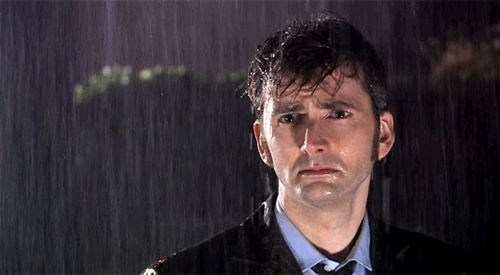
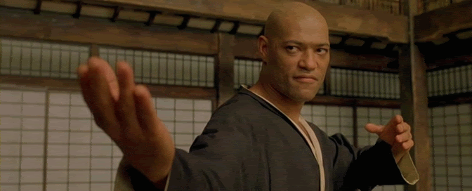
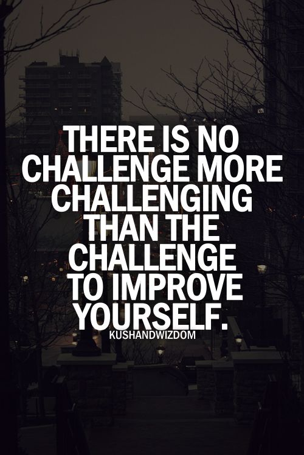

In the last weeks, I've been asked a few times to document a bit more my journey into web development, so I'm writing this post as a general guide/track that I hope might prove useful, in special to those who are following [FreeCodeCamp](http://www.freecodecamp.com)'s curriculum.

##Background

Last year, while we were preparing to leave our country, I made the decision to switch careers, as it would be very difficult to find a job as an electronics engineer given the conditions on which we were going to live.

Also, I've always been a computers geek and had some experience with programming (mostly C, some C#) and a story with amateur web design (mostly Wordpress blogs), so I first came to the conclusion that C# and ASP.NET was the way to go.

Then, I started doing some reads on C#, signed-up for a Udemy course and jumped in to my new .NET career for about... 2 days, until a dev friend told me about this new thing called ***Node.js***. 2 blog posts later and goodbye C\#.

#First steps#

Fast forward to Mexico and after doing some reserach, I stumbled up with [Learn JavaScript Properly](http://www.reddit.com/r/learnjavascript/comments/2179b5/learn_javascript_properly_omnibus_post_for_the/), which was my first *real* approach to coding in JavaScript.

About 2 weeks later, I became bored as the program mostly focused on reading Professional JavaScript for Web Developers, and started a web marketing project (ClickBank) which didn't go as planned but at least gives me some much needed passive income.

In the meantime, without any structure or clear goal, I started learning **Node.js** and did many [CodeSchool](http://www.codeschool.com) courses. I also started doing some small projects with what I learned, including a real-time car GPS visualization using socket.io, a spanish multi-corpus scraper to help my wife in her doctorate and an article remixer for my marketing venture.

And the software **did** work, but once I wanted to start adding more features, I realized the code was a ***callback nightmare*** and delicious ***spaghetti***, so I needed to strengthen my basic skills. Also, I abandoned my marketing venture and decided (again) to become an **excellent developer**, this time for real. Bring it on, JavaScript!

#Enter FreeCodeCamp#

In January, I came back to learning JavaScript (and HTML, and CSS), and after a second research, I found about FreeCodeCamp in a site with many [JavaScript Learning Paths](http://js.startrack.io/). Since I've already been learning JS and also did CodeAcademy/CodeSchool courses, I rushed through most of the challenges, and in a few days I completed all the easy and medium [Coderbyte](http://coderbyte.com/CodingArea/Challenges/) challenges, which marked the end of FCC's curriculum and made me eligible for nonoprofit work.

#Beyond FreeCodeCamp#

Once I finished FCC's curriculum, it was time for nonprofit work (which I'm currently doing), but the curriculum doesn't get you very far in terms of depth, algorithms, frameworks and best practices. So it was time to start doing some serious training. Back to the site where I found FreeCodeCamp, and after some reads, I started with Eric Elliot's path: a lot of books, readings and videos. From the list, that you can find on [this link](https://medium.com/javascript-scene/learn-javascript-b631a4af11f2), I went through the following readings (in order):

1. Eloquent JavaScript (good intro, sometimes too eloquent)
2. JavaScript: The Good Parts (300% recommended. Short and concise. A good alternative is "JavaScript Succintly" if you want to go the 100% free path, but try to get JS:TGP since it's awesome. JS Succintly is also a good complementary read if you need to feel more confident after Eloquent JavaScript.)
3. Programming JavaScript Applications (Very good too)
4. The Two Pillars of JavaScript (short articles, somewhat opinionated but good reads)

Also, derived from that list, I read "JavaScript Allongé" which is a good advanced intro to functional programming and higher order functions. After reading this I got a new perspective on JavaScript, and that summed to some coding examples by Danny Fritz (@dannyfritz) and Nathan (@terakilobyte) from FCC, made me develop a great interest for functional programming and Ramda, which I recommend instead of Lodash or Underscore.

In between, I also started building this blog. For that purpose, I learned some [Sass](http://sass-lang.com/) and [Jade](http://jade-lang.com/) with a dash of Markdown, and since I wanted to learn something else apart from Bootstrap, I gave [Bourbon](http://bourbon.io/) and Neat a try. So far I'm liking them a lot, since I don't have to mess that much with classes like in Bootstrap.

Then, I started going through all the resources found in [This Gist](https://gist.github.com/ericelliott/d576f72441fc1b27dace), also by Eric Elliot. I've already watched every video and read every article on the "required" sections, and I recommend that you also do it. That's where I found about Functional Reactive Programming.

#The Road to Functional Greatness#

After the Functional Reactive Programming readings and videos (Netflix presentation) I got really hyped with this paradigm. It's not the ultimate solution for every problem, but certainly I see it applied to most current async applications. That lead me to watch **"Hardcore functional programming"** from Frontend Masters, and from there I went to learn more about functors, monads and the [Fantasy Land](https://github.com/fantasyland/fantasy-land) spec. It's the daily bread in languages like Haskell, but it's very new in JavaScript, with many benefits associated.

Once finished with "Hardcore Functional Programming", I went back to learning Reactive stuff. Most prominent libraries are the [Reactive Extensions (Rx)](http://reactivex.io/), used by many big guns including Microsoft and Netflix, and [Bacon.js](https://baconjs.github.io/), which is inspired by Rx. Before starting, I made a [little example](http://codepen.io/crisberrios/pen/ogPWmJ?editors=001) just because I couldn't wait before I started using this new enlightened paradigm.

There are lots of resources on Rx. Here's an outline of what I've been reading/doing:

1. [The introduction to Reactive Programming you've been missing](https://gist.github.com/staltz/868e7e9bc2a7b8c1f754)
2. [A General Theory of Reactivity](https://github.com/kriskowal/gtor)
3. [Rx Book](https://xgrommx.github.io/rx-book/content/summary.html)
4. [Learn Rx](http://reactive-extensions.github.io/learnrx/) (Also, a great resource for understanding the basic functional methods like map, reduce and filter)
5. [Transducers are coming](http://blog.cognitect.com/blog/2014/8/6/transducers-are-coming)
6. [Transducers.js: A JavaScript Library for Transformation of Data](http://jlongster.com/Transducers.js--A-JavaScript-Library-for-Transformation-of-Data)
7. [Functors, Applicatives, And Monads In Pictures](http://adit.io/posts/2013-04-17-functors,_applicatives,_and_monads_in_pictures.html)

Don't expect this to be an easy reading, but it will change the way you see the flow of data inside a program.

#What's Next?#

So, you've arrived at where I am now. Where are the frameworks? you might ask. To tell you the truth, I don't really care that much. My reasoning is that if I become very good at JS, any framework will be easy to learn. In special, the ones that are more modular, like Backbone or Riot. Node is just a JS enviroment, and FRP covers a lot of what you do in the backend, and Express is built to made things easy for the devs. Still, my focus is:

1. Finish learning Rx/Bacon and use it as much as I can in my future projects.
2. Keep getting better at functional programming. It's easy to ready, easy to extend, easy to reuse the code made this way and easy to test.
3. Learn some sought-after skills, since a "I don't know anything about Angular, but I'm a quick learner" won't do in most cases.
4. Build a portfolio
5. Prepare for interviews
6. Keep learning something new everyday.

Bonus: keep pairing and helping other campers. Helping others has helped me a lot with solidifying my basic skills. I've learned from my errors when trying to explain something, and I keep learning better ways to do the same routines. Also, I'm practicing my english (which is not my native language), so it's a win/win.

#Reading List and Final Thoughts#

For the next days/weeks, I have the following books/courses on my reading/watching list:

1. You don't know JS series
2. Cracking the Code Interview
3. Elements of Programming Interviews
4. Programming Interviews Exposed (not so sure about this one)
5. Mostly everything on [this page](https://plus.google.com/+AddyOsmani/posts/H3onog42Msj) by Addy Osmani

And this is the end for now. I still have a long way to go, but my goal is to **land a good job**, in a **good company**, in a **good country**, and do **great things** doing the **thing I love**.

So I have to ***become a better coder***.

